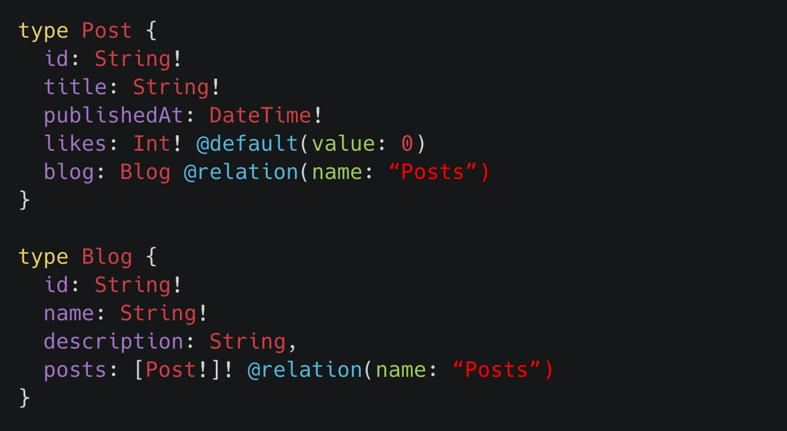

# Designing Your GraphQL Schema

## Designing Your GraphQL Schema (1)



## Designing Your GraphQL Schema (2)

:::::: {.columns}
::: {.column width="50%"}

### Database Layout

```
TABLE foo
    INT    id,
    STRING name,
    INT    bar.id

TABLE bar
    INT    id,
    STRING name
```

:::
::: {.column width="50%"}

### GraphQL Schema

```graphql
type Foo {
    id:    Int!
    name:  String!
    barId: Int!
}
type Bar {
    id:   Int!
    name: String!
}
type Query {
    foos: [Foo!]!
    bars: [Bar!]!
}
```

:::
::::::

## Designing Your GraphQL Schema (3)

:::::: {.columns}
::: {.column width="50%"}

### Database Layout

```
TABLE foo
    INT    id,
    STRING name,
    INT    bar.id

TABLE bar
    INT    id,
    STRING name
```

:::
::: {.column width="50%"}

### GraphQL Schema

```graphql
type Foo {
    id:   Int!
    name: String!
    bar:  Bar!
}
type Bar {
    id:   Int!
    name: String!
}
type Query {
    foos: [Foo!]!
    bars: [Bar!]!
}
```

:::
::::::

## Designing Your GraphQL Schema (4)

:::::: {.columns}
::: {.column width="50%"}

### Database Layout

```
TABLE foo
    INT    id,
    STRING name,
    INT    bar.id

TABLE bar
    INT    id,
    STRING name
```

:::
::: {.column width="50%"}

### GraphQL Schema

```graphql
type Foo {
    id:   Int!
    name: String!
    bar:  Bar!
}
type Bar {
    id:   Int!
    name: String!
    foos: [Foo!]!
}
type Query {
    foos: [Foo!]!
    bars: [Bar!]!
}
```

:::
::::::

## Designing Your GraphQL Schema (5)

:::::: {.columns}
::: {.column width="50%"}

### Database Layout

```
TABLE foo
    INT    id,
    STRING name,
    INT    bar.id

TABLE bar
    INT    id,
    STRING name
```

:::
::: {.column width="50%"}

### GraphQL Schema

```graphql
type Foo {
    id:   Int!
    name: String!
    bar:  Bar!
}
type Bar {
    id:   Int!
    name: String!
    foos: [Foo!]!
}
type Query {
    foos(ids: [Int!]): [Foo!]!
    bars(ids: [Int!]): [Bar!]!
}
```

:::
::::::

# Executing GraphQL Queries

## Executing GraphQL Queries

```scala
// Global constant.
val yourSchema: Schema[YourContextType, Unit] = ...

// Usually create one per request.
val yourContext: YourContextType = ...

// Contained in POST body of incoming request.
val unparsedQuery: String = ...

// May contain a SyntaxError
val parsedQuery: Try[Document] = QueryParser.parse(unparsedQuery)

// May contain a ValidationError
val futureResult: Future[Json] = Executor.execute(
  queryAst    = parsedQuery.get, // Try.get, don't actually do this!
  userContext = yourContext,
  schema      = yourSchema
)
```

# Defining Your Data Layer

## Defining Your Data Layer

:::::: {.columns}
::: {.column width="50%"}

### Database Layout

```
TABLE foo
    INT    id,
    STRING name,
    INT    bar.id

TABLE bar
    INT    id,
    STRING name
```

:::
::: {.column width="50%"}

### Data Layer

```scala
case class Foo( id:    Int,
                name:  String,
                barId: Int     )

case class Bar( id:   Int,
                name: String )

trait Ctx {}
```

:::
::::::

# Implementing Your Schema

## Implementing Your Schema (1)

:::::: {.columns}
::: {.column width="50%"}

### Data Layer

```scala
case class Foo( id:    Int,
                name:  String,
                barId: Int     )

trait Ctx {}
```

### GraphQL Schema

```graphql
type Foo {
    id:   Int!
    name: String!
    bar:  Bar!
}
```

:::
::: {.column width="50%"}

### Sangria Schema Implementation

```scala
lazy val foo: GqlObject[Ctx, Foo] = ???
```

:::
::::::

## Implementing Your Schema (2)

:::::: {.columns}
::: {.column width="50%"}

### Data Layer

```scala
case class Foo( id:    Int,
                name:  String,
                barId: Int     )

trait Ctx {}
```

### GraphQL Schema

```graphql
type Foo {
    id:   Int!
    name: String!
    bar:  Bar!
}
```

:::
::: {.column width="50%"}

### Sangria Schema Implementation

```scala
lazy val foo: GqlObject[Ctx, Foo] =
  deriveObjectType[Ctx, Foo]()
```

:::
::::::

## Implementing Your Schema (3)

:::::: {.columns}
::: {.column width="50%"}

### Data Layer

```scala
case class Foo( id:    Int,
                name:  String,
                barId: Int     )

trait Ctx {}
```

### GraphQL Schema

```graphql
type Foo {
    id:   Int!
    name: String!
    bar:  Bar!
}
```

:::
::: {.column width="50%"}

### Sangria Schema Implementation

```scala
lazy val foo: GqlObject[Ctx, Foo] =
  deriveObjectType[Ctx, Foo](
    ReplaceField(
      fieldName = "barId",
      field     = ???
    )
  )
```

:::
::::::

## Implementing Your Schema (4)

:::::: {.columns}
::: {.column width="50%"}

### Data Layer

```scala
case class Foo( id:    Int,
                name:  String,
                barId: Int     )

trait Ctx {}
```

### GraphQL Schema

```graphql
type Foo {
    id:   Int!
    name: String!
    bar:  Bar!
}
```

:::
::: {.column width="50%"}

### Sangria Schema Implementation

```scala
lazy val foo: GqlObject[Ctx, Foo] =
  deriveObjectType[Ctx, Foo](
    ReplaceField(
      fieldName = "barId",
      field     = GqlField(
        name      = "bar",
        fieldType = bar,
        resolve   = exe => ???
      )
    )
  )
```

:::
::::::

## Implementing Your Schema (5)

:::::: {.columns}
::: {.column width="50%"}

### Data Layer

```scala
case class Foo( id:    Int,
                name:  String,
                barId: Int     )

trait Ctx {
  def fooBar(foo: Foo): Action[Ctx, Bar]
}
```

### GraphQL Schema

```graphql
type Foo {
    id:   Int!
    name: String!
    bar:  Bar!
}
```

:::
::: {.column width="50%"}

### Sangria Schema Implementation

```scala
lazy val foo: GqlObject[Ctx, Foo] =
  deriveObjectType[Ctx, Foo](
    ReplaceField(
      fieldName = "barId",
      field     = GqlField(
        name      = "bar",
        fieldType = bar,
        resolve   = exe =>
          exe.ctx.fooBar(exe.value)
      )
    )
  )
```

:::
::::::

## Implementing Your Schema (6)

:::::: {.columns}
::: {.column width="50%"}

### Data Layer

```scala
case class Bar( id:   Int,
                name: String )

trait Ctx {
  def fooBar(foo: Foo): Action[Ctx, Bar]
  def barFoos(bar: Bar): Action[Ctx, Seq[Foo]]
}
```

### GraphQL Schema

```graphql
type Bar {
    id:   Int!
    name: String!
    foos: [Foo!]!
}
```

:::
::: {.column width="50%"}

### Sangria Schema Implementation

```scala
lazy val bar: GqlObject[Ctx, Bar] =
  deriveObjectType[Ctx, Bar](
    AddFields(
      GqlField(
        name      = "foos",
        fieldType = GqlList(foo),
        resolve   = exe =>
          exe.ctx.barFoos(exe.value)
      )
    )
  )
```

:::
::::::

## Implementing Your Schema (7)

:::::: {.columns}
::: {.column width="50%"}

### Data Layer

```scala
trait Ctx {
  ...
  def queryFoos()
  def queryBars()
}
```

### GraphQL Schema

```graphql
type Query {
  foos(ids: [Int!]): [Foo!]!
  bars(ids: [Int!]): [Bar!]!
}
```

:::
::: {.column width="50%"}

### Sangria Schema Implementation

```scala
lazy val query: GqlObject[Ctx, Unit] = ???
```

:::
::::::

## Implementing Your Schema (8)

:::::: {.columns}
::: {.column width="50%"}

### Data Layer

```scala
trait Ctx {
  ...
  def queryFoos(
    ids: Option[Seq[Int]]
    ): Action[Ctx, Seq[Foo]]

  def queryBars(
    ids: Option[Seq[Int]]
    ): Action[Ctx, Seq[Bar]]
}
```

### GraphQL Schema

```graphql
type Query {
  foos(ids: [Int!]): [Foo!]!
  bars(ids: [Int!]): [Bar!]!
}
```

:::
::: {.column width="50%"}

### Sangria Schema Implementation

```scala
lazy val query: GqlObject[Ctx, Unit] = ???
```

:::
::::::

## Implementing Your Schema (9)

:::::: {.columns}
::: {.column width="50%"}

### Data Layer

```scala
trait Ctx {
  ...
  def queryFoos(
    ids: Option[Seq[Int]]
    ): Action[Ctx, Seq[Foo]]

  def queryBars(
    ids: Option[Seq[Int]]
    ): Action[Ctx, Seq[Bar]]
}
```

### GraphQL Schema

```graphql
type Query {
  foos(ids: [Int!]): [Foo!]!
  bars(ids: [Int!]): [Bar!]!
}
```

:::
::: {.column width="50%"}

### Sangria Schema Implementation

```scala
lazy val ids:
  GqlArgument[Option[Seq[Int]]] =
    GqlArgument(
      name         = "ids",
      argumentType =
        GqlOptionInput(GqlListInput(GqlInt))
    )

lazy val query: GqlObject[Ctx, Unit] = ???
```

:::
::::::

## Implementing Your Schema (10)

:::::: {.columns}
::: {.column width="50%"}

### Data Layer

```scala
trait Ctx {
  ...
  def queryFoos(
    ids: Option[Seq[Int]]
    ): Action[Ctx, Seq[Foo]]

  def queryBars(
    ids: Option[Seq[Int]]
    ): Action[Ctx, Seq[Bar]]
}
```

### GraphQL Schema

```graphql
type Query {
  foos(ids: [Int!]): [Foo!]!
  bars(ids: [Int!]): [Bar!]!
}
```

:::
::: {.column width="50%"}

### Sangria Schema Implementation

```scala
lazy val ids = ...

lazy val query: GqlObject[Ctx, Unit] =
  GqlObject(
    name   = "Query",
    fields = gqlFields[Ctx, Unit](
      ???, // foos field
      ???  // bars field
    )
  )
```

:::
::::::

## Implementing Your Schema (11)

:::::: {.columns}
::: {.column width="50%"}

### Data Layer

```scala
trait Ctx {
  ...
  def queryFoos(
    ids: Option[Seq[Int]]
    ): Action[Ctx, Seq[Foo]]

  def queryBars(
    ids: Option[Seq[Int]]
    ): Action[Ctx, Seq[Bar]]
}
```

### GraphQL Schema

```graphql
type Query {
  foos(ids: [Int!]): [Foo!]!
  bars(ids: [Int!]): [Bar!]!
}
```

:::
::: {.column width="50%"}

### Sangria Schema Implementation

```scala
lazy val query: GqlObject[Ctx, Unit] =
  GqlObject(
    name   = "Query",
    fields = gqlFields[Ctx, Unit](
      GqlField(
        name      = "foos",
        fieldType = GqlList(foo),
        arguments = List(ids),
        resolve   = exe => ???
      ),
      GqlField(
        name      = "bars",
        fieldType = GqlList(bar),
        arguments = List(ids),
        resolve   = exe => ???
      )
    )
  )
```

:::
::::::

## Implementing Your Schema (12)

:::::: {.columns}
::: {.column width="50%"}

### Data Layer

```scala
trait Ctx {
  ...
  def queryFoos(
    ids: Option[Seq[Int]]
    ): Action[Ctx, Seq[Foo]]

  def queryBars(
    ids: Option[Seq[Int]]
    ): Action[Ctx, Seq[Bar]]
}
```

### GraphQL Schema

```graphql
type Query {
  foos(ids: [Int!]): [Foo!]!
  bars(ids: [Int!]): [Bar!]!
}
```

:::
::: {.column width="50%"}

### Sangria Schema Implementation

```scala
lazy val query: GqlObject[Ctx, Unit] =
  GqlObject(
    name   = "Query",
    fields = gqlFields[Ctx, Unit](
      GqlField(
        ...
        resolve   = exe =>
          exe.ctx.queryFoos(exe.arg(ids))
      ),
      GqlField(
        ...
        resolve   = exe =>
          exe.ctx.queryBars(exe.arg(ids))
      )
    )
  )
```

:::
::::::
